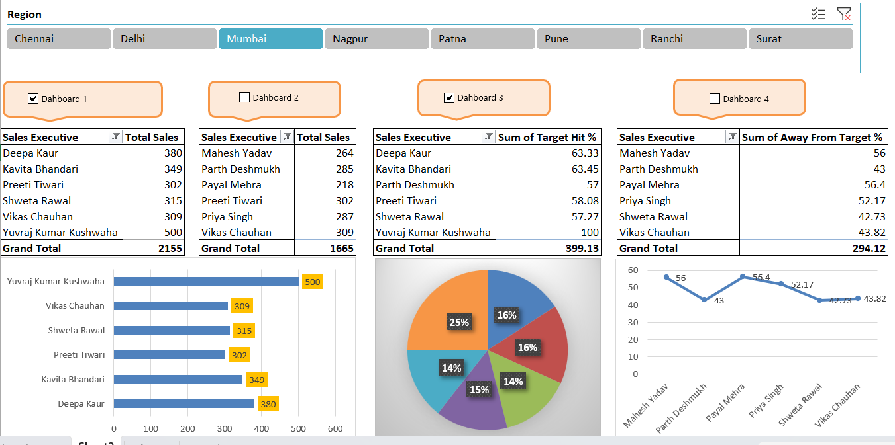

# 📊 Excel Sales Dashboard (with VBA Macros)

🚀 An **interactive Sales Dashboard** built in **Microsoft Excel** using  
**Pivot Tables, Slicers, Charts, Conditional Formatting, and VBA Macros**.  

It provides **region-wise & executive-wise sales insights** with automated navigation between multiple dashboards.

---

## ✨ Features
- ✅ Region-wise sales analysis with slicers (Chennai, Delhi, Mumbai, etc.)
- ✅ Multiple dashboards with **VBA Macro buttons** for navigation
- ✅ KPIs for:
  - Total Sales by Executive
  - Target Hit % vs Away From Target %
- ✅ Interactive Visuals:
  - 📊 Bar Chart – Executive performance
  - 🥧 Pie Chart – Sales distribution
  - 📈 Line Chart – Performance trends
- ✅ Conditional Formatting for highlights
- ✅ Automated data refresh with Macros

---

## 🛠 Tools & Techniques
- Microsoft Excel
- Pivot Tables & Pivot Charts
- Slicers & Filters
- Conditional Formatting
- VBA Macros (Automation + Navigation)
- Formulas (SUM, AVERAGE, Percentage)

## 📂 Project Structure
📁 excel-sales-dashboard
│── 📊 Dashboard.xlsm # Interactive dashboard with macros
│── 📊 Sales_Data.xlsx # Raw/Processed sales data
│── 📸 screenshot.png # Dashboard preview image

---

## 📸 Preview
Here’s a glimpse of the dashboard:  

---

## 🔮 Future Scope
- Integration with **Power BI / Tableau** for advanced analytics  
- Adding **real-time data connections** (SQL/CSV imports)  
- Building a **fully automated reporting system**  

---

## 👨‍💻 Author
**Yuvraj Kumar Kushwaha**  
- 🌐 [GitHub](https://github.com/YourGitHubUsername)  
- 💼 [LinkedIn](https://linkedin.com/in/YourLinkedInProfile)  

